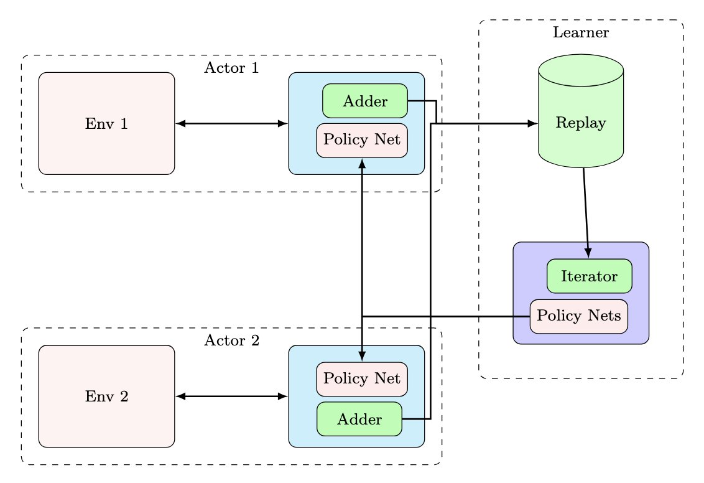

# Distributed RL Systems

> 原帖: [AI basics April 25:  Distributed RL Systems](https://x.com/NandoDF/status/1915548697548464359)

*Agent*是一种能够感知*environment*、自主采取行动(**actions**)以实现目标，并可通过*RL*或指导提升性能的实体。*Agent*可拥有内部目标（如推断出的子目标，以及对更多观察、学习或控制的追求——这正是我们需要考虑安全问题的地方！），也可拥有外部目标，这些外部目标既可通过奖励(**reward**)函数明确指定，也可通过反馈*reward*信号表达。下图展示了RL的主要组成部分。

*Agent*可以是与用户（它的*environment*）交互的多模态神经网络，目标是通过个性化教育赋能用户。*Agent*观察越多，就越容易创建个性化课程来辅助用户。

工业级*LLMs*的*RL*可能涉及数百万次同步交互，使用数十亿参数模型和整个数据中心。这绝非廉价之举！构建在如此庞大规模下高效运行的RL系统(**RL systems**)远非易事。在此，我仅提供对这类可扩展分布式系统(**scalable distributed systems**)的浅层概述。向Anthropic、DeepMind、DeepSeek、Meta、微软AI、OpenAI、X等公司的杰出工程师们致敬！在我看来，他们就像英超联赛中最优秀的足球运动员一样独特且极具才华。

正如我的一些同事所讨论的（参见[《IMPALA: Scalable Distributed Deep-RL》](https://arxiv.org/abs/1802.01561)和[acme: A library of reinforcement learning](https://github.com/google-deepmind/acme)），现代*distributed RL systems*可分为两个组件：行动者(**Actors**)和学习者(**Learners**)。每个行动者通过一个称为策略(**policy**)的网络(**network**)与*environment*交互生成*actions*。*Actors* 还从*environment*中收集*rewards*和观察结果。收集的数据被添加到共享的回放记忆(**replay memory**)中。 *Learner*从*replay memory*中采样数据并用于更新*policy network*。更新*network*后，权重(**weight**)检查点需要发送给每个*actor*。设计此类系统时，衡量每项操作的持续时间、测量每个通信链路的带宽等至关重要。这需要精确的工程设计和全面的测量与消融研究。

在语言领域，*actors*是聊天机器人*agents*，而*environments*则是人类。每次对话的数据随后被发送到*replay memory*中用于学习。通常，*learner*可能需要比*actors*更多的存储和计算资源，因为*learner*需要跟踪梯度(**gradients**)和其他大规模统计数据。

了解*actors*推理成本、通信成本和学习成本非常重要。在某些情况下，这些成本允许*agent*进行同策略(**on-policy**)学习。由于不同*actors*可能以不同速度和时间收集数据，这个过程通常是异步的。

如果数据收集速度不够快，*learner*可能需要从记忆中重放旧示例来更新*policy*。这就是异策略(**off-policy**)设置。在这种情况下，需要纠正模型使用陈旧数据学习的问题——还记得[4月24日推文](2025-04-24_RL vs SFT.md))中关于驾驶的例子吗？过度脱离*policy*可能很危险！幸运的是，我们稍后将看到研究人员已经有一些解决方案，例如重要性*weights*和其他加权机制，如在[近端策略优化(Proximal policy optimization, **PPO**)](https://en.wikipedia.org/wiki/Proximal_policy_optimization)和[DeepSeek-R1](https://arxiv.org/abs/2501.12948)论文中出现的权重。

最后，有时可以仅从大型回放数据库学习policy。这被称为离线RL(off-line RL)或批量RL(batch RL)。*Off-line RL*优于*supervised learning*，因为它包含前文讨论的*selection mechanisms*，但当然不如*on-line RL*，因为它缺乏在*environments*中直接生成*actions*的能力。然而，*off-line RL*非常有用，因为它允许在交互成本过高或危险的情况下进行学习。

顺便说一下，我很乐意解答您可能有的任何问题。您也可以完全不同意我的观点，即使是关于枯燥的技术话题，但所有意见都受欢迎。好像我需要在X上特别声明这一点似的😂