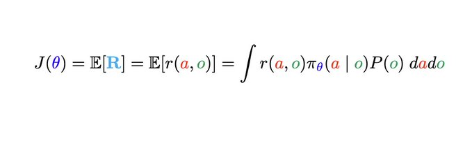
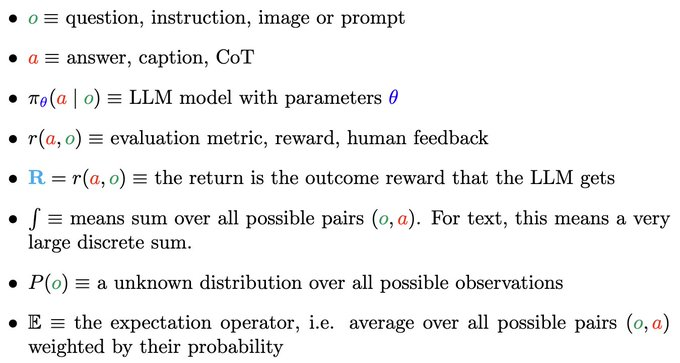
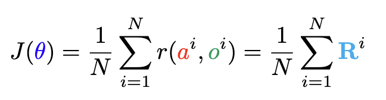
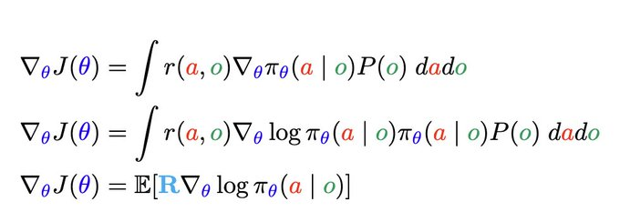
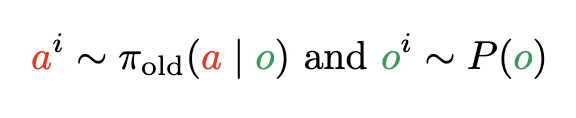
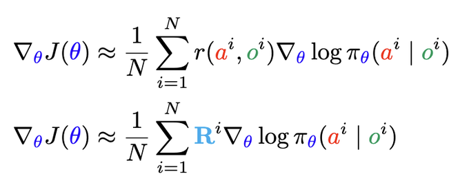
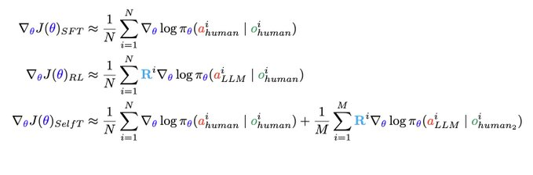
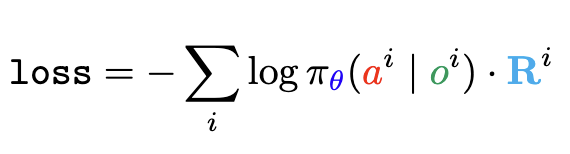
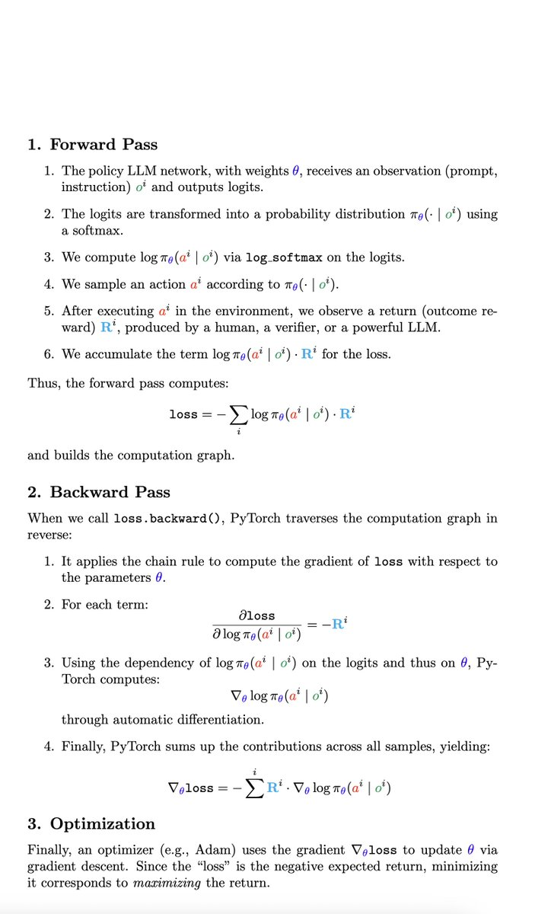

# One-Step RL and Policy Gradients

> 原帖: [April 29: One-Step RL and Policy Gradients](https://x.com/NandoDF/status/1917270302666678614)

许多团队，包括[DeepSeek-R1](https://arxiv.org/abs/2501.12948)，在进行RL时优化以下的一步(one-step)目标函数：

这些数学符号代表以下概念：

即我们在所有数据字符串(a,o)上对LLM进行微调。我使用积分符号表示文本情况下的大型离散求和。因此，如果我们有一个包含N对观察和行动(o,a)的数据集，我们在实践中会如下评估目标函数：

在实际应用中，环境(用户)会给我们提供观察(提示或指令o)。所以我们不需要知道分布P(o)。由于我们不知道最优行动(LLM生成内容，即行动a)，我们将对它们进行积分。这是在概率中处理未知量的标准方法。我们对所有可能的值进行加权求和，权重为其出现概率。在这种情况下，行动的概率就是LLM产生的结果。LLM是一个概率模型。

这种在最大化LLM权重的同时对LLM输出求和的方法，被称为最大期望效用(maximum expected utility)，这是博弈论中理性代理所做的事情。通过最大化期望效用(奖励的另一种说法)，可以收敛到纳什均衡。在统计学中，人们称之为边缘化(marginalisation)，当它还涉及对某个量进行最大化(例如本例中的LLM权重theta)时，这被称为实验设计(experimental design)。

总之，在一步RL中，我们通过调整LLM策略来最大化期望回报R，即在大多数LLM中的单一结果奖励R=r(a,o)(见前文)。

策略梯度(Policy Gradients)
这就是人们所说的在策略(on-policy)RL或Reinforce。之所以称为在策略，是因为生成样本(行动)的策略(LLM模型)与被学习的策略是相同的。

这种方法在生成样本比学习更便宜时很有意义。也就是说，当学习者能够轻松按需获取新样本时。这在某些情况下可能成立，但在昂贵的游戏模拟引擎中并非如此，在那里必须引入缓冲区和回放记忆来缓存数据。数据随后会变得过时，这就需要离策略(off-policy)方法，我们将在下一节中讨论这点。现在，我们将看看如何计算一步损失的梯度，然后简单地沿梯度方向更新参数。

让我们推导一步目标的策略梯度。梯度只是关于每个LLM参数theta的导数向量。理论上，可以使用微积分如下获得：

同样，我们使用大写R表示回报，在这种情况下是一步结果奖励。

如果我们从用户生成(采样)提示o，并使用LLM策略采样解决方案a，在数学上我们表示为：

我们可以用蒙特卡洛(Monte Carlo)方法近似策略梯度：

现在我们有了梯度，就可以简单地沿着梯度方向来最大化目标函数。Jax和PyTorch等工具使我们能够轻松实现这一点。

策略梯度、SFT和自我训练(Self-Training)
比较RL的策略梯度与监督式微调(supervised fine tuning，最大似然)的梯度很有启发性：

如我们所见，RL有额外的R^i项，它缩放了对数损失。此外，标签来自LLM模型，而非人类(或GPT4o)数据集。RL能自我提升。R可用于只选择最佳样本，所以模型学会仅模仿好的样本。这就是我所说的RL教师批改作业：它提供一个分数R，告诉我们哪些方面值得模仿，哪些方面不值得模仿。

自我训练方法可以将监督学习与更大的由模型标记的数据集结合起来。这是上述第三个梯度。强化自我训练(Reinforced Self-Training, ReST)是LLM的一个很好例子。它确实可以用于自我提升，同时保持与人类示范的接近性。在ReST中，奖励用于对样本排序。随后，ReST仅使用排名最高的样本重新学习策略。

PyTorch中的策略梯度
在PyTorch中，我们通常定义一个"损失"函数，如下所示：

这不是通常监督学习意义上的真正损失，而是一个代理，其梯度给我们提供了更新策略参数的方向(策略梯度)。

这涉及使用自动微分的常规前向和反向传播，如下所示：

明天我们将看到，我们可以使用最大似然来解决一步目标函数，即无需将其视为RL。然而，新的解释并不会给我们带来太多收益。基本上，你可以有很多解释，但梯度最终是相同的……或多或少如此。