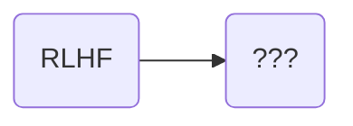

## 值得参考的2个PPT

+ [ChatGPT + Post-Training](https://docs.google.com/presentation/d/11KWCKUORnPpVMSY6vXgBeFSWo7fJcuGQ9yuR6vC1pzE)
+ [The state of post-training](https://docs.google.com/presentation/d/1FL6pzRT3tjCfJ985emS_2YfujCe_iz6dsyRcDIUFPqs)

## 资料途径
+ 百度、bing
+ B站、YouTube
  + https://www.bilibili.com/video/BV1fJciefEq3
+ GitHub
  + https://github.com/mbzuai-oryx/Awesome-LLM-Post-training
+ https://www.interconnects.ai/
+ https://magazine.sebastianraschka.com/
+ 论坛
  + https://x.com/NandoDF/articles

## Post-training History

## 当前问题
+ RL、RLHF、Post-training的关系
+ RLHF和具体算法（例如：PPO之类的）的关系

## 参考论文
